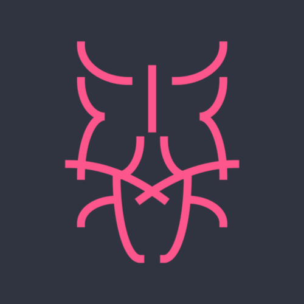

<p align="center">
  
</p>

<h2>
  babel-plugin-log-and-return
  <a href="https://travis-ci.org/lionize/babel-plugin-log-and-return">
    
  </a>
  <a href="https://github.com/lionize/babel-plugin-log-and-return/releases/tag/v0.0.3">
    
  </a>
  <a href="./LICENSE">
    
  </a>
</h2>

Use an @log decorator to log the expression in the next line

<a href="#install">Install</a> •
<a href="#usage">Usage</a> •
<a href="#created-by">Created By</a> •
<a href="#license">License</a>

## Install

`$ npm install --save-dev babel-plugin-log-and-return`

Then add the plugin to your `.babelrc` file or `babel` configuration in `package.json`:

```json
"plugins": ["log-and-return"]
```

## Usage

Simply add an `@log` decorator in a comment above the line you want to log:

```js
// @log
hello('world')
```

This compiles to something similar to:

```js
_l(hello('world'))

function _l(x) {
  console.log(x)
  return x
}
```

## Created By

* [Mark Chandler](http://github.com/lionize)

## License

MIT
